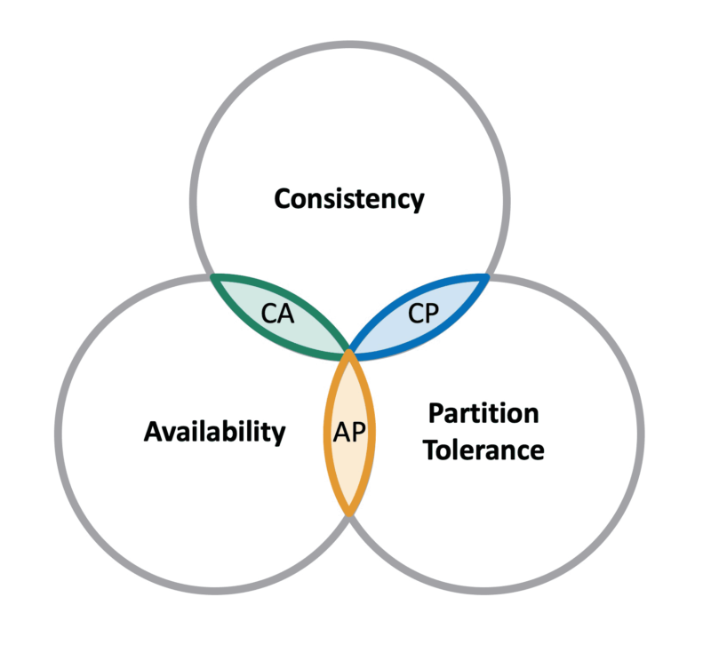
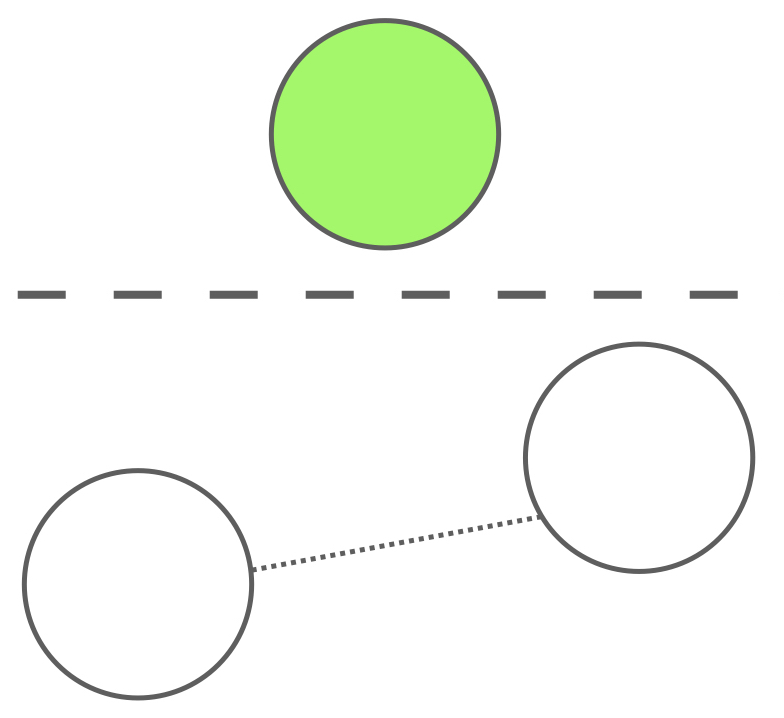

# 分布式系统中的脑裂
分布式系统中的脑裂是什么？
什么情况下会发生脑裂？
如何判断你的系统有没有脑裂？
## 脑裂的起源
脑裂最初指的是把大脑中左脑和右脑之间连接切断的手术，切断后左右脑各自处理自己的信息，信息互相不传递。

在分布式系统中，脑裂也是类似的意思，因为网络不通导致出现了两个或以上分区，他们各自执行各自的任务，互相不知道别的分区的存在。

## CAP 理论
大家一定听说过计算机系统中的 CAP 理论。
CAP 是计算机系统中的不可能三角形。

一致性、可用性、分区容忍度，这三个条件不可能同时满足。
## 单主系统
某些情况下，我们希望系统中只有一个主节点，比如对同一份存储写入数据等，这样的系统出现多主，往往意味着出现问题。

在分布式系统中，网络分区是不可避免的，网络分区指部分节点间无法通信。
而发生了网络分区，就会产生多个主的情况。
在单主系统中出现了多个主，并且它们分别正常执行了主的任务，就是我们说的产生了脑裂。

根据前面的 CAP 理论，脑裂其实是牺牲了 CAP 中的 C，即牺牲了一致性的系统，因为多主同时执行导致了数据的不一致。
## 如何判断是否脑裂
1. 有网络分区就一定会有多主
因为网络分区没法避免，那么产生多主也无法避免。
2. 多主能否保证一致性
什么是一致性？
consistency 在牛津字典中的解释：
> the quality of always behaving in the same way or of having the same opinions, standard, etc.; the quality of being consistent.

就是说每一次执行的结果都是一样的，如果多主操作同一份数据，因为无法确定它们的先后顺序，每次执行的结果可能会不一样，这就是所谓的不一致。
只要产生不一致，就会有脑裂问题。
## 示例 - 分布式锁
我们来看一个例子，使用分布式锁的场景。

因为锁只能分配给一个人，所以获得了锁的那个就是主，主可以对数据进行写入。
这种场景会有脑裂问题吗？
答案是会。

如果 A 与分布式锁的网络断开了，那么就存在一种可能，A 以为自己还持有着分布式锁，而此时对于锁服务来说，A 的锁已经超时了，因此假如此时 B 想要获得锁，那么锁是可以被 B 获取到的。此时，B 合法获得了锁，因此可以对数据进行写入，而 A 以为自己有锁，因此也对数据进行写入，二者的先后顺序无法确定，因此结果是不一致的，这就是发生了脑裂问题。
## 解决办法
脑裂问题的核心其实是多主导致的不一致问题。
怎么简单且可靠地解决这类问题呢？
解决方法很简单：加一个序号。
每产生一个主，就把序号加一，这样不同的主拥有的序号都不一样，并且序号大小决定了它们成为主的先后顺序。
只要我们把系统设定成：只有序号更大的主才能操作共享的数据，就保证了在多主同时操作的情况下结果是确定的。此时如果产生了两个主，它们的序号必然有大小。如果序号小的主在序号更大的主之后试图执行写操作，那么请求将被拒绝。这就保证了小序号的主无法覆盖大序号主的操作，保证了结果的确定性，也就保证了一致性。
现在来看看之前分布式锁的例子，看这个方法能不能解决问题。
首先 A 获得了锁，A 的序号是 1 ，它能够成功写入数据。

然后 A 的网络断了，锁也超时了，B 获得了锁，这时 B 的序号是 2，它也能够正常写入数据。

这时 A 又试图去写数据，它的序号还是 1，存储服务发现已经有个序号为 2 的主写过数据了，所以把它拒绝了。

之前的问题核心是，A 在 B 之后能够正常写入，所以导致了数据不一致，现在 A 的请求被拒绝了，那么一致性的问题不就解决了。
所以，用加一个序号的方法，我们解决了分布式锁例子中，多主导致的不一致问题，或者说是脑裂问题。
## 示例 - RAFT 算法
实际上几乎所有的一致性问题，都可以通过加一个序号的方法解决。
比如大家熟知的一致性算法 raft，其实也是这个思路。
raft 是一个能够自主选主的算法，它不需要额外依赖一个分布式锁，通过节点间投票的方式选出一个主，只要保证集群中多数节点可用，就一定能够选出主节点。

使用 raft 算法自然也避免不了网络分区的问题，因此也会出现多主的情况。
我们来看图示，图中有三个节点，它们已经选出了一个主。现在出现了网络分区，主被隔开了。

由于 raft 算法的设计，只有有超过半数节点响应，主节点才能够正常写入数据。因此在网络分区时，原主还无法写入。

但如果此时网络忽然恢复了，原主就能够获得所有节点的响应了。
现在有两个主可以写入了，怎么办呢？

答案还是加一个序号。在 raft 中，这个序号叫作 term.
每生成一个新主，term 就会加一，在发生网络分区时，新选举出来的主比老主的序号 term 要大。

这样，在老主试图写入时就会发现，现在的主序号比自己大，那么自己就一定不是主，它会自觉降级成普通节点，多主写入的问题就这样解决了。
看到这里你明白了吗？分布式系统中脑裂或不一致的问题，通过一个序号就可以轻松解决。
你的系统中有没有类似的问题，你想到解决方案了吗？
